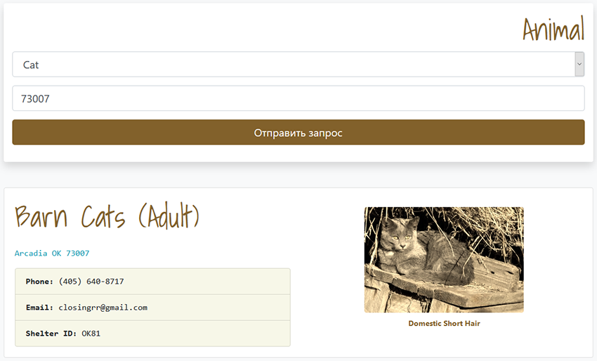

**About:** Vanilla **JS** App, use: **Parcel**, **Babel** and **Fetch JSONP** package to deal with cross domain requests.

**API:** [Petfinder](https://www.petfinder.com/developers/api-docs)

**Instruction:** In root directory:

```
npm i -g parcel-bundler
npm install
parcel index.html
```
Open __*localhost:1234*__ in your browser, choise animal-option in select, enter your zipcode (*Example: 73007*) and get animal-list.

- - -

- - -
Mail for communication: <ProUnebit@yandex.ru>
